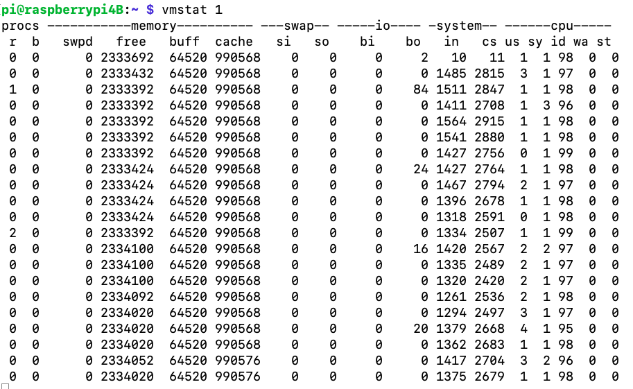
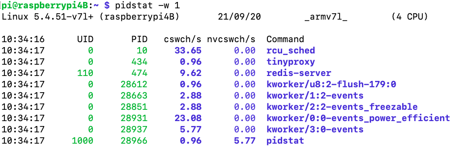
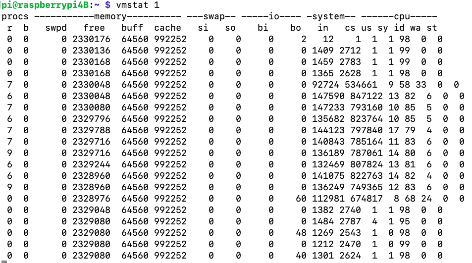
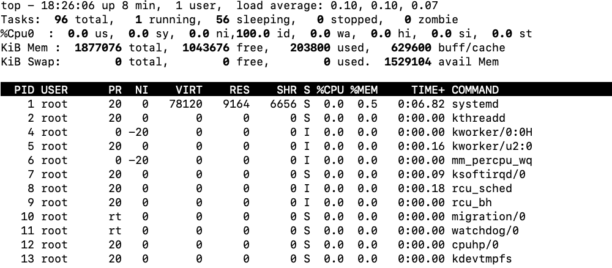
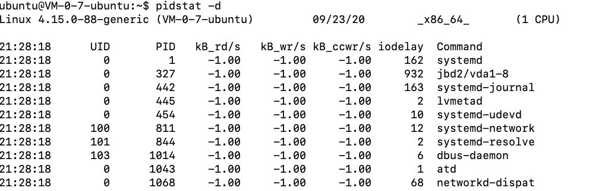

# 概览

性能分析步骤：

1. 选择指标评估应用程序和系统性能
2. 为应用程序和系统设置性能目标
3. 进行性能基准测试
4. 性能分析定位瓶颈
5. 优化系统和应用程序
6. 性能监控和告警

总结起来就是：指标-测试-优化


下图是Linux常用性能工具图谱


# CPU

## 平均负载

什么是平均负载？

平均负载是指单位时间内，系统处于可运行状态可不可中断状态的平均进程数，也就是平均活跃进程数，它和CPU使用率并没有直接关系。

- 可运行状态的进程，是指正在使用CPU或者正在等待CPU的进程，常用ps命令看到处于R（Running或Runnable）的进程
- 不可中断状态的进程则是处于内核态关键流程中的进程，并且这些流程是不可打断的，如最常见的是等待硬件设备的I/O响应，ps命令中看到的D状态的进程


在评判系统平均负载时，需要了解系统的CPU个数，可以使用`top`或者从`proc/cpuinfo`中读取

```bash
grep 'model name' /proc/cpuinfo|wc -l
```

当平均负载大于CPU个数时，系统已经出现了过载，一般超过70%应该需要排查负载高的原因。


CPU使用率表示的是单位时间内CPU繁忙情况的统计，而平均负载是指单位时间内处于可运行状态和不可中断状态的进程数，不仅包含了正在使用CPU的进程，还包括了CPU和等待I/O的进程

- CPU密集型进程，使用大量CPU会导致平均负载升高，此时CPU使用率也是很高的
- I/O密集型进程，等待I/O会导致平均负载升高，但CPU使用率不一定很高
- 大量等待CPU的进程调度也会导致平均负载升高，CPU使用率也会比较高


可以使用下工具进行CPU的平均负载测试（apt-get install -y stress stress-ng sysstat）

- `uptime`：查看平均负载的工具
- `stress`： Linux 系统压力测试工具
- `stress-ng`：stress的高级版本
- `mpstat`：是一个常用的多核 CPU 性能分析工具，用来实时查看每个 CPU 的性能指标，以及所有 CPU 的平均指标。
- `pidstat`：pidstat 是一个常用的进程性能分析工具，用来实时查看进程的 CPU、内存、I/O 以及上下文切换等性能指标。

打开三个终端

**终端一**

```
//在终端中每次输入完以下指令后，在看终端二、三
stress -c 1 --timeout 600
stress -i 1 --hdd 1 --timeout 600
stress -c 8 --timeout 600
```

**终端二**

```
watch -d uptime
```

**终端三**

```
mpstat -P ALL 5
pidstat -u 5
```

## 上下文切换

CPU上下文切换：将先前一个人的CPU上下文（也就是CPU寄存器和程序计数器）保存起来，然后加载新任务的上下文到这些寄存器和程序计数器，最后跳转到程序计数器所指的新位置，运行新任务。


CPU上下文切换可分为三个场景

1. 进程上下文切换
2. 线程上下文切换
3. 中断上下文切换

**进程上下文切换**

- 系统调用：特权模式切换
- 进程上下文切换：进程上下文切换比系统调用多了异步-保存当前进程的内核状态和CPU寄存器之前，需要先把该进程的虚拟内存、堆栈等保存下来；而加载了下一进程的内核态后，还需要刷新进程的虚拟内存和用户栈。

当存在大量进程上下文切换时，将会导致CPU将大量时间耗费在寄存器、内核以及虚拟内存等资源的保存和恢复上，进而大大缩短了真正运行进程的时间。

**线程上下文切换**

线程是调度的基本单位，进程时资源拥有的基本单位。内核中的任务调度实际上的调度对象是线程；而进程只是给线程提供了虚拟内存、全局标量等资源。

- 多个线程会共享相同的虚拟内存和全局变量等资源。这些资源在上下文切换时是不需要修改的
- 线程由自己的私有数据，比如栈和寄存器等，这些在上下文切换时需要保存

根据上面对比可以发现，同一进程内部，多个线程的上下文切换的开销肯定是要小于多个进程的上下文开销，因为线程共享同一进程的虚拟内存和全局变量，在线程切换时只需要保存私有数据。

**中断上下文切换**

中断会打断进程的正常调度和执行，转而调用中断处理程序，响应设备事件。

和进程上下文不同，中断上下文切换并不涉及到进程的用户态。所以，即便中断过程打断了一个正在用户态的进程，也不需要保存和恢复这个进程的虚拟内存。全局变量等用户态资源。中断上下文，其实只包括内核态中断服务程序执行所比需的状态，包括CPU寄存器、内核堆栈、硬件中断参数等

对同一个CPU来说，中断处理比进程拥有更高的优先级，所以中断上下文切换并不会与进程上下文切换同时发生。


上下文切换常用vmstat工具查看，该工具主要分析系统CPU上下文切换和中断以及内存使用情况



- cs(context switch):每秒上下文切换的次数
- in(interrupt)：每秒钟中断次数
- r(Runing or Runnable)：就绪队列的长度，正在运行和等待CPU的进程数
- b(blocked):处于不可中断睡眠状态的进程数



- cswch：表示每秒自愿上下文切换的次数
- nvcswch：表示每秒非自愿上下文切换的次数

> 自愿上下文切换：指进程无法获取所需资源，导致的上下文切换。如：I/O、内存等系统资源不足时，就会发生自愿上下文切换
>
> 非自愿上下文切换：指进程由于时间片已到等原因，被西永强制调度，进而发生的上下文切换。如：大量进程争抢CPU时，容易发生非自愿上下文切换

模拟大量线程上下文切换情况

```
sysbench --num-threads=10 --max-time=300 --test=threads run
```

同时再另外一个终端内输入

```
vmstat 1
```

注意观察`r`,`in`,`cs`,`us`,`sys`这几列，在`r`列数值变高时，`us`和`sys`加起来基本上快要有100%，`sys`表示系统占用，该值过高表示CPU主要是被内核占用了。



使用如下指令只能看出进程占用CPU很高，但是进程的上下文切换数值不高

```
pidstat -w -u 1
```

使用如下指令看线程的上下文切换

```
pidstat -wt 1
```

上述也说了，中断数量过多，可以通过如下指令查看何种中断导致

```
watch -d cat /proc/interrupts
```

可以发现变化速度最快的是重调度中断(RES),这个终端类型表示，唤醒空闲状态的CPU来调度新的任务运行。这是多处理器系统(SMP)中，调度器用来分散任务到不同CPU的机制，通常也被称为处理器间中断。


上下文切换次数取决于系统本身CPU的性能。系统的上下文切换次数比较稳定，从数百到一万以内，都应该算是正常的。但是当上下文切换次数超过一万次，或者切换次数出现数量级的增长时，可能会出现性能问题

- 自愿上下文切换变多，说明进程都在等待资源
- 非资源上下文切换变多，说明进程都在被强制调度，也就是在争抢CPU，此时CPU成为瓶颈
- 中断次数变多，需要通过`/proc/interrupts`文件来分析具体中断类型

## CPU使用率

CPU使用率相关的重要指标

- user(us):代表用户态CPU时间。不包括nice时间，但包括了guest时间
- nice(ni):代表低优先级用户态CPU时间，也就是进程的nice值被调整为1-19之间时的CPU时间。nice可能的取值范围是-20到19，数值越大，优先级反而越低
- System(sys):代表内核态CPU时间
- idle(id):代表空闲时间。不包括等待I/O的时间(iowait)
- Iowait(wa):代表等待I/O的CPU时间
- irq(hi):代表处理硬中断的CPU时间
- softirq(si):代表处理软中断的CPU时间
- steal(st):代表当系统运行在虚拟机中的时候，被其他虚拟机占用的CPU时间
- guest(guest):代表通过虚拟化运行其他操作系统的时间，也就是运行虚拟机的CPU时间
- guest_nice(gnice):代表以低优先级运行虚拟机的时间

可以使用`man proc`查看proc目录下各个文件输出所代表的含义

可以使用`top`、`pidstat`这两个工具查找CPU占用比较高的程序

在Linux下经常使用`perf`分析CPU性能


在某些情况下，碰到常规问题无法解释的CPU使用率情况时，首先要想到有可能是短时应用导致的问题

- 应用中直接调用了其他二进制程序，这些程序通常运行时间比较短，通过top等工具不容易发现
- 应用本身在不停地崩溃重启，而启动过程的资源初始化，非常有可能会占用相当多的CPU

对于这类进程，可以用`pstree`、`execsnoop`找到其父进程，再从父进程所在的应用入手

## 进程状态

top输出如下

其中S列（Status列）表示进程状态

- R（Running、Runnable）：表示进程在CPU就绪队列中，正在运行或者正在等待运行
- D（Disk Sleep）:不可中断睡眠(Uninterruptible Sleep)，一般表示进程正在跟硬件交互，并且交互过程不允许被其他进程中断或打断
- Z（Zombie）：僵尸进程，进程实际已经结束，但是父进程还没有回收它的资源（比如进程的描述符、PID等）
- S（Interrupt Sleep）：可中断的书面，表示进程因为等待某个事件而被系统挂起。当进程等待的事件发生时，它会被唤醒并进入R状态
- I（Idle）：空闲中台，用在不可中断睡眠的内核线程上。硬件交互导致的不可中断进程用D表示，但是对某些内核线程来说，可能实际上并没有任何负载，用Idle正是为了区分这种情况。D会导致平均负载升高，I状态的进程确不会
- T（Stopped、Traced）:表示进程处于暂停或者跟踪状态。向一个进程发送 SIGSTOP 信号，它就会因响应这个信号变成暂停状态（Stopped）；再向它发送 SIGCONT 信号，进程又会恢复运行（如果进程是终端里直接启动的，则需要你用 fg 命令，恢复到前台运行）。而当你用调试器（如 gdb）调试一个进程时，在使用断点中断进程后，进程就会变成跟踪状态，这其实也是一种特殊的暂停状态，只不过你可以用调试器来跟踪并按需要控制进程的运行。
- X（Dead）:表示进程已经消亡，不会在top或者ps中看到



**不可中断状态**

- 为了保证进程数据与硬件状态一直，正常情况下，不可中断状态在很短时间内就会结束。所以，短时的不可中断状态进程，一般可以忽略。
- 如果系统或者硬件发生了故障，继承可能会在不可中断状态保持很久，甚至导致系统出现大量不可终端进程。这时需要注意是不是系统出现了I/O等性能问题

**僵尸进程**

- 当一个进程创建了子进程之后，应该通过系统调用wait()或者waitpid()等待自己成结束，回收子进程的资源；而子进程在结束时，会向它的父进程发送SIGCHLD信号，所以父进程可以注册SIGCHLD信号的处理函数，异步回收资源
- 僵尸进程持续的时间都比较短，在父进程回收它的资源后就会消亡；或者在父进程退出后，由 init 进程回收后也会消亡。
- 一旦父进程没有处理子进程的终止，还一直保持运行状态，那么子进程就会一直处于僵尸状态。大量的僵尸进程会用尽 PID 进程号，导致新进程不能创建，所以这种情况一定要避免。



- KB_rd:每秒读KB数
- KB_wr:每秒写KB数
- iodelay:I/O延迟

> 可以使用man pidstat查看pidstat的使用

对于僵尸进程，需要通过`pstree`找到其父进程，查找具体原因

```
#a 表示输出命令行选项
#p表PID
#s表示指定进程的父进程
#具体可以使用man pstree查看
pstree -aps pid
```

