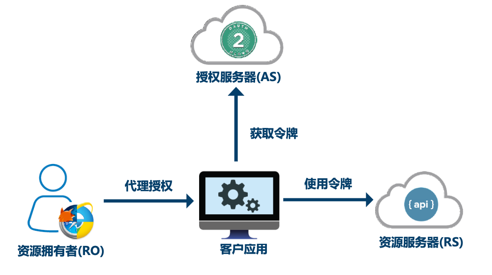
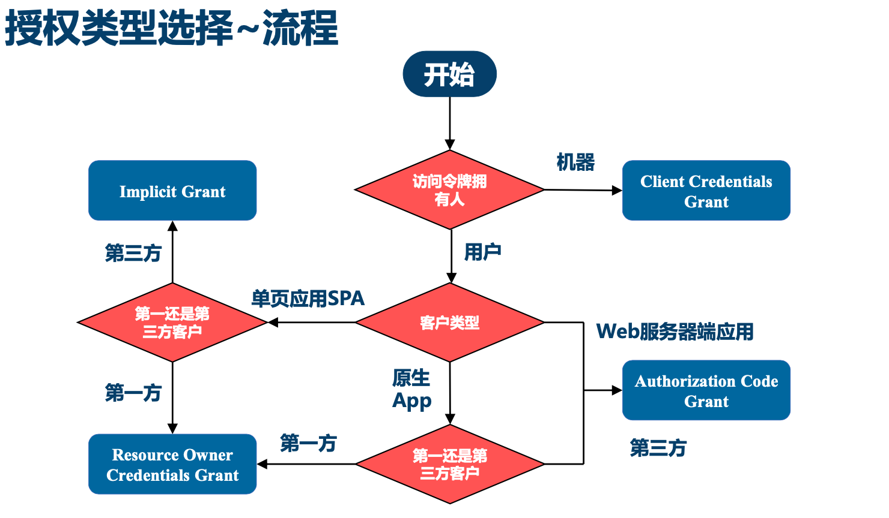

# 微服务安全架构

## OAuth2

[阮一峰:理解OAuth 2.0](http://www.ruanyifeng.com/blog/2014/05/oauth_2_0.html)

场景

1. 开放系统间授权
   - 社交联合登录
   - 开放API平台
2. 现代微服务安全
   - 单页浏览器App(HTML5/JS/无状态)
   - 无线原生APP
   - 服务器端WebApp
   - 微服务和API见调用
3. 企业内部应用认证授权（IAM/SSO）

OAuth 2.0定义

- 用于REST/APIs的代理授权框架（delegated authorization framework）
- 基于令牌Token的授权，在无需暴露用户密码的情况下，使应用能获取对用户数据的有限访问权限
- 事实上的标准安全框架，支持多种用例场景
- 解耦认证和授权

优势

- 比1.0版本更易于实现
- 更安全，客户端不接触用户密码，服务器端更易集中保护
- 广泛传播并被持续采用
- 短寿命和分装的token
- 资源服务器和授权服务器解耦
- 集中式授权，简化客户端
- HTTP/JSON友好，易于请求和传递token
- 考虑多种客户端架构场景
- 客户可以具有不用的信任级别

劣势

- 协议框架宽泛，造成各种实现的兼容性和互操作性差
- 和OAuth 1.0不兼容
- OAuth 2.0不是一个认证协议

- 客户应用：通常是一个Web或者无线应用，需要访问用户的受保护资源
- 资源服务器：web站点或者web service API，用户的受保护数据存放地
- 授权服务器：在客户应用成功认证并获得授权之后，向客户应用颁发访问令牌Access Token
- 资源拥有者：资源的拥有人，想要分享某些资源给第三方应用
- 客户凭证：客户的clientId和密码用于认证客户
- 令牌：授权服务器在接收到客户请求后，颁发的访问令牌
- 作用域：客户请求访问令牌时，由资源拥有者额外指定的细分权限

OAuth令牌类型

- 授权码（Authorization Code Token）：仅用于授权码授权类型，用于交换获取访问令牌和刷新令牌
- 刷新令牌（Refresh Token）：用于去授权服务器获取一个新的访问令牌
- Bear Token：不管谁拿到Token都可以访问资源
- 访问令牌（Access Token）：用于代表一个用户或者服务直接去访问受保护的资源
- Proof Of Possession（PoP） Token：可以校验client是否对Token有明确的拥有权

OAuth 2.0授权模式

- 授权码（Authorization Code）
- 简化（Implicit）
- 用户名密码（Resource Owner Credentials）
- 客户端凭证（Client Credentials）

